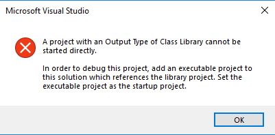

# Common PowerPoint Add-in Development Traps

This document details the common pitfalls when developing for PowerPointLabs, so that these mistakes can be noted/avoided by future contributors.

1. The index of an Office collection starts from 1, however note that the index of a collection provided by .NET starts from 0
`ShapeRange range = getCurrentSelectedShapes(); range[1] ... ; //the first element`

1. When you delete, cut, or ungroup a shape programmatically, and you undo this change from the PowerPoint UI, then that shape will become corrupted. For a corrupted shape, accessing attributes programatically other than it's `left`/`top`/`width`/`height`/`name` would throw an exception.<br><br>One possible solution would be re-allocate the shape’s memory; copy and paste it programmatically before you handle the shape.<br><br>Another possible solution would be to use the method called `CorruptionCorrection`, located in `ShapeUtil`, for fixing corrupted shapes although it may not work for every type of corruption

1. When dealing with pictures or shapes, your features should not override user's clipboard contents. Use the `RestoreClipboardAfterAction` method in `ClipboardUtil` if your feature requires copying/pasting to maintain user's clipboard contents

1. When pasting a shape programmatically, it is not selected in Office 2010, but selected in Office 2013

1. When using `shape.Duplicate()`, the animations are copied in Office 2013 but not 2016. Recommended to use `slide.RemoveAnimationsForShape()` to remove animations

1. When pasting a shape in the current slide, its naming mechanism is like this:
   1. Index increment for default name. E.g. Rectangle 1 -> Rectangle 2 
   1. Unchanged for non-default name. E.g. MyRectangle -> MyRectangle
   
1. Some Office APIs are not supported for Office 2010, e.g. `MergeShape`. When developing, special attention needs to be given to APIs available for Office 2010

1. Some Office APIs may not work correctly, e.g. `WindowBeforeDoubleClick` event. You may have to use a workaround. Be sure to include a short comment in the code if a non-conventional workaround is used

1. When a shape is rotated, its position attributes, i.e. `left` and `top`, will always return the value when its rotation angle is at zero. Thus to get the rotated position, you may calculate it using its [rotation matrix](http://en.wikipedia.org/wiki/Rotation_matrix)

1. When you need to convert Shape(s) to a ShapeRange object, you can consider using the `ToShapeRange` method in `PowerPointSlide`

1. Effects rendering is slow, especially for pictures and 3D images. You may try to avoid it, or make it rendered (e.g. export the picture with effects, and then insert it again)

1. When you copy and paste a slide, the slide name will be lost:
   1. Original slide name = “My slide”
   1. After paste slide name = “Slide\d+”

1. Event triggering order of `WindowDeactivated` and `PresentationClose` is different between PowerPoint 2010 and 2013. In 2010, `PresentationClose` will be triggered before `WindowDeactivated`, but this order is reversed in 2013

1. Accessing the `ActivePresentation.Saved` property on a new, unsaved presentation, always results in the `ActivePresentation.Saved` property returning `msoFalse`, regardless of whether the new presentation contains any valid changes to be saved.

1. Visual Studio may show the error "Output Type of Class Library cannot be started directly", shown below. This is caused by errors in Visual Studio's project configuration.

	

	The default fix is to delete the .vs folder in ./PowerPointLabs/PowerPointLabs for Visual Studio to recreate the configuration files. Alternatively, you can do the following:

	Step 1. Right click Solution 'PowerPointLabs' (3 projects) in the solution explorer.
	
	Step 2. Click Properties.
	
	Step 3. Navigate to Common Properties > Startup Project.
	
	Step 4. Select Single startup project and choose PowerPointLabs from the drop down list.

1. To group multiple `Shape` objects together when you only have the references to the objects, an easy way is to extract a `ShapeRange` object from the slide based on the names of the shapes, and then call the `Group()` method on that `ShapeRange`
```c#
string[] names = new string[] { shape1.Name, shape2.Name };
Shape group = this.GetCurrentSlide().Shapes.Range(names).Group();
```