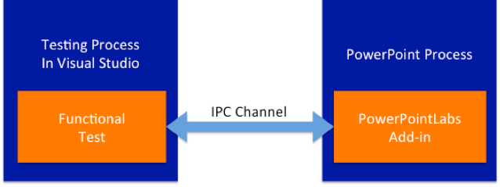
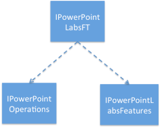

# Dealing with Functional Tests

This guide aims to provide a basic idea of the overall structure of Functional Tests (FTs) in PowerPointLabs.

## What is a FT?
FT is an automatic integration test, in which PowerPointLabs add-in is running in PowerPoint application, and without any mock or stub components (unlike in Unit Testing).
 
FT is important to prevent software regression in PowerPointLabs. Because refactoring code happens frequently, without adequate test cases we won’t feel confident when PowerPointLabs is delivered to users. FT is built to help with automating the test processes that is required to ensure the quality of the end-product.

## How does a FT work?
When PowerPointLabs add-in starts up, it will set up an Inter-Process Communication (IPC) channel. Then when Functional Test runs, it will try to connect to this IPC channel and communicate with PowerPointLabs add-in through the interface for remoting.

This interface for remoting is called `IPowerPointLabsFT`, from which developers can obtain another two interfaces: `IPowerPointOperations` and `IPowerPointLabsFeatures`.

1. `IPowerPointOperations` include basic APIs to operate on PowerPoint objects, e.g. selecting the 4th slide, selecting the shape with name "Text 3", closing the current presentation, etc.
1. `IPowerPointLabsFeatures` include the APIs to execute PowerPointLabs features, e.g. Auto Crop, Auto Animate, Add Spotlight, etc.

Interfaces `IPowerPointOperations` and `IPowerPointLabsFeatures` are both implemented in PowerPointLabs add-in project. When FT is calling the interface API, it is actually the implementation in PowerPointLabs add-in being called.

Currently, FT has utility tools that can support comparing the pictures, shapes, slides, animations, effects, message box etc, which means it has covered most of the testing scenarios. But to some extent, developers still need to verify the animations ***manually***, and then prevent any regression automatically by FT.

## How to run a FT?
From inside Visual Studios:
1. Go to `Test` -> `Windows` -> `Test Explorer`
1. To run all tests, simply click `Run All`
1. To run specific FTs, simply ctrl-click all relevant FTs, right-click and select `Run Selected Tests`
1. Tests results would also be displayed in the Test Explorer

## How to debug a FT?
1. Debug base on error log reported by test results
1. Comment out the `TearDown` method in `BaseFunctionalTest`, so that the presentation under test would not be closed, allowing you to manually verify the slides in PowerPoint

## How to write new FTs?
1. Create a testing template, which are PowerPoint slides on which the FT would run. Follow the structure of existing testing templates in the ***doc/test*** folder and make sure it is readable and verifiable
1. In the code, when writing test class, ensure that it is `public`, it has inherited from `BaseFunctionalTest` and that the method `GetTestingSlideName`, which returns the file name of testing template, is implemented
1. Rebuild to include new test in Test Explorer

Some general rules when writing FTs:
- When there’s animation or effect in the slide, `SlideUtil.IsSameAnimations` will be needed to assert the slides have the same animations, e.g. `AutoAnimateTest`
- When the looking is changed in the picture, slide or shape, `SlideUtil.IsSameLooking` will be needed to assert the slides or shapes have the same looks, e.g. AutoCropTest
- When it is to test negative cases, usually message box will be popped up, and `MessageBoxUtil.ExpectMessageBoxWillPopUp` will be needed
- When `IPowerPointOperations` or `IPowerPointLabsFeatures` don’t have the API you need, you may need to create or modify it. Sometimes, calling method of the PowerPoint Object Model in a FT may not work (e.g. `Shape.Export method`, due to some security limit), then this method can be implemented in `IPowerPointOperations` to get over it (e.g. `IPowerPointOperations.ExportSelectedShapes` method)
