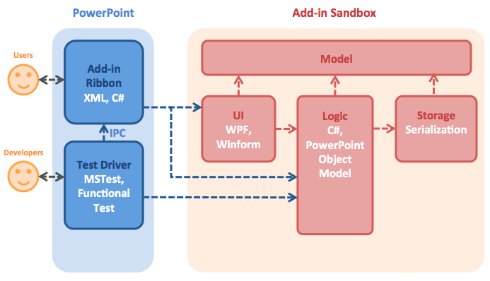

## Software Design

  
PowerPointLabs is an add-in for PowerPoint. Given above is an overview of the main components.

* **Add-in Ribbon**: The UI seen by users in the PowerPoint Ribbon tabs or context menu. It consists in [`ThisAddIn.cs`](../PowerPointLabs/PowerPointLabs/ThisAddIn.cs), [`Ribbon1.cs`](../PowerPointLabs/PowerPointLabs/Ribbon1.cs), and [`Ribbon1.xml`](../PowerPointLabs/PowerPointLabs/Ribbon1.xml). `ThisAddIn.cs` is in charge of add-in's lifecycle and other important events. `Ribbon1.xml` defines the styles of add-in ribbon and context menu, and `Ribbon1.cs` is the entry point that routes the user requests to the UI and Logic through the Action Framework. **Any changes made in `Ribbon1.cs` or `ThisAddIn.cs` should be generic enough to be used by every feature**.
* **UI**: The UI seen by users as a sidebar (AKA task pane) or window. [`WPF`](https://msdn.microsoft.com/en-us/library/mt149842(v=vs.110).aspx) and Winform (***deprecated***) techniques are used to build the UI, and [`MVVM pattern`](https://msdn.microsoft.com/en-us/library/hh848246.aspx) is preferred to implement UI-related features. Not all features require a UI.
* **Logic**: The main part of the add-in that implements features logic.
* **Test Driver**: PowerPointLabs relies on the test automation to prevent regression. [`Functional Test`](../PowerPointLabs/Test/FunctionalTest) and [`Unit Test`](../PowerPointLabs/Test/UnitTest) is used to automate testing against UI and Logic. [`Test data`](test) is accessed during testing. 
* **Storage**: PowerPointLabs generally uses `Temp` folder to store temporary data and `Documents` folder to save user data and settings.
* **Model**: This includes the [`PowerPoint Object Model`](https://msdn.microsoft.com/en-us/library/microsoft.office.interop.powerpoint(v=office.14).aspx) and some wrapper classes of the `PowerPoint Object Model`.
* Many [`Windows APIs`](https://github.com/PowerPointLabs/PowerPointLabs/blob/master/PowerPointLabs/PowerPointLabs/NativeMethods.cs) are used as a supplement to Office APIs.

## Add-in Ribbon & UI

The diagram below shows the structure of Ribbon & UI with [Action Framework](../PowerPointLabs/PowerPointLabs/ActionFramework). 


When a request (e.g. click a button) comes to the `Ribbon`, `HandlerFactory` will create a `Handler` to handle the request. In the `Handler`, it can use `ActionFrameworkExtensions` to access the current context (e.g. current selected shape, current slide), use some `Feature Logic` (e.g. fit to width) to handle the request, or display some `Feature UI` (e.g. a sidebar).

### To create a new feature

- **All new features are required to use [Action Framework](../PowerPointLabs/PowerPointLabs/ActionFramework)**, instead of keeping putting non-generic new codes into `Ribbon1.cs`.
- Set up [ribbon.xml](../PowerPointLabs/PowerPointLabs/Ribbon1.xml#L394). Provide a unique id for the ribbon control. You can use a tag if there are multiple ribbon controls that use the same feature.

```xml
<button id="EditName"
        getLabel="GetLabel"
        getImage="GetImage"
        onAction="OnAction"/>
```

- Set up handlers. In this example, we will need handlers for [Label](../PowerPointLabs/PowerPointLabs/ActionFramework/ShortcutsLab/EditName/EditNameLabelHandler.cs), [Image](../PowerPointLabs/PowerPointLabs/ActionFramework/ShortcutsLab/EditName/EditNameImageHandler.cs), and [Action](../PowerPointLabs/PowerPointLabs/ActionFramework/ShortcutsLab/EditName/EditNameActionHandler.cs).

```cs
// Provide the ribbon control id or tag to link this handler to the ribbon control
[ExportActionRibbonId("EditName")]
class EditNameActionHandler : ActionHandler
```

- Access PowerPoint context if required.
To access the PowerPoint context, type `this.` in a ActionHandler or WPF UI control, and then you'll be able to access a list of context getters provided by [ActionFrameworkExtensions](../PowerPointLabs/PowerPointLabs/ActionFramework/Common/Extension/ActionFrameworkExtensions.cs).
- Set up WPF UI if required. To set up a sidebar UI, you'll need to wrap the WPF UI in a Winform UI [[example]](../PowerPointLabs/PowerPointLabs/PositionsLab), and then call [`this.RegisterTaskPane`](../PowerPointLabs/PowerPointLabs/ActionFramework/Common/Extension/ActionFrameworkExtensions.cs#L77) to register the sidebar. For the UI style, we're using Metro style UI provided by [Mahapps](http://mahapps.com).
- Call the feature logic from the ActionHandler or UI to complete the request.

## Logic & Testing

The diagram below shows the structure of backend. 


UI and ActionHandler can call feature logic to process the request. Test component (unit test and functional test) can call feature logic to do test-automation. Feature logic is built upon `PowerPoint Object Model`, [`other model classes`](../PowerPointLabs/PowerPointLabs/Models), and some other components.

**For any new logic, try not to use any obsolete classes**, which may undermine the testability.

### Notes

- The feature logic should be [`SOLID`](http://www.codeproject.com/Articles/703634/SOLID-architecture-principles-using-simple-Csharp) and [`testable`](http://www.toptal.com/qa/how-to-write-testable-code-and-why-it-matters), and be organized into its own package/folder.
- For testable logic, it can be tested by `Unit Test (UT)`. For untestable/legacy/UI logic, it can be tested by `Functional Test (FT)`. Instructions of testing can be found [here](../PowerPointLabs/Test/README.md).
- It's highly recommended to use [Logger](../PowerPointLabs/PowerPointLabs/ActionFramework/Common/Log/Logger.cs) to capture significant events in features. For example, **all exceptions must be logged**.
- It's highly recommended to model slide-level or presentation-level behaviours by extending [`PowerPointSlide.cs`](../PowerPointLabs/PowerPointLabs/Models/PowerPointSlide.cs) and [`PowerPointPresentation.cs`](../PowerPointLabs/PowerPointLabs/Models/PowerPointPresentation.cs).

## Conventions

* Ensure the codes are [`SOLID`](http://www.codeproject.com/Articles/703634/SOLID-architecture-principles-using-simple-Csharp) and [`testable`](http://www.toptal.com/qa/how-to-write-testable-code-and-why-it-matters).
