 # Technical Troubleshooting Guide

This guide serves as a collection of technical issues/solutions commonly seen when trying to install PowerPointLabs.

If better solutions to any issue are found, or if there is a need for any clarification, please kindly let us know at pptlabs@comp.nus.edu.sg

### Table of Issues
1. [Certificate Not Trusted](#cert-not-trusted)
1. [VSTO Installer Config Error](#vsto-installer-config)
1. [NET Framework Not Installed](#net-not-installed)
1. [VSTO Opens as XML Error](#vsto-as-xml)
1. [Missing PowerPointLabs Ribbon](#missing-ribbon)
1. [Corruption requiring renaming of VSTOInstaller.exe.config File](#rename-vsto-file)
1. [Installation Failure caused by ClickOnce Cache](#clickonce-cache)
1. [Referenced Assembly Not Installed](#assembly-not-installed)
1. [Corrupted Zip Installer](#corrupted-zip)
1. [Installation Error due to Preexisting Similar Application](#preexisting-application)
1. [Error Loading Manifest from MahApps.Metro.dll](#error-manifest)

## Certificate Not Trusted<a name="cert-not-trusted"></a>
#### Error Message
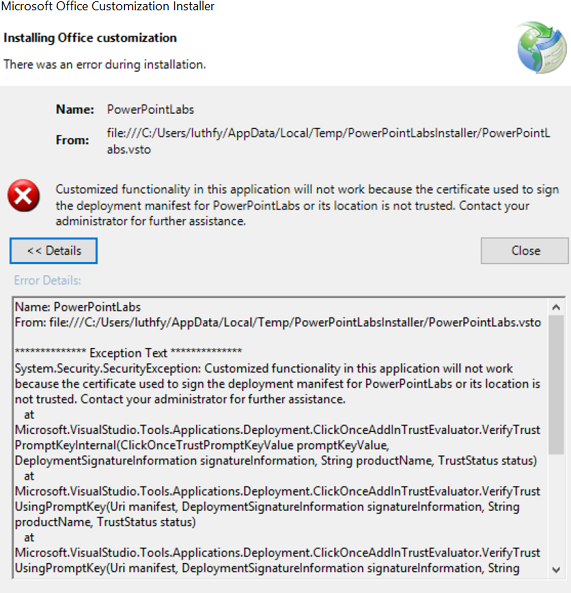
#### Solution
1. Try to download and install from the [standalone version](https://www.google.com/url?q=http%3A%2F%2Fwww.comp.nus.edu.sg%2F~pptlabs%2Fdownload-78563%2FPowerPointLabsInstaller.zip)
1. If standalone is not working, click OK for the batch file and install again
1. Else, verify admin permission and install again
1. If error persists after above steps, launch PowerPoint and go to File > Options > Certificate
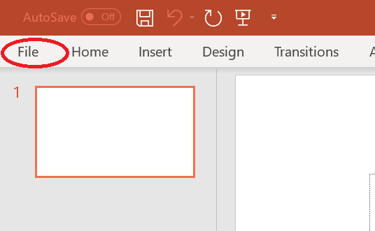
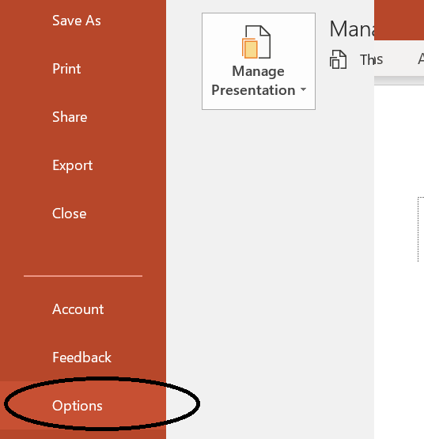
1. A window should open. Go to Trust Center > Trust Center Settings

1. In the new window, go to Add-ins. Uncheck "Require Application Add-ins to be signed by Trusted Publisher"
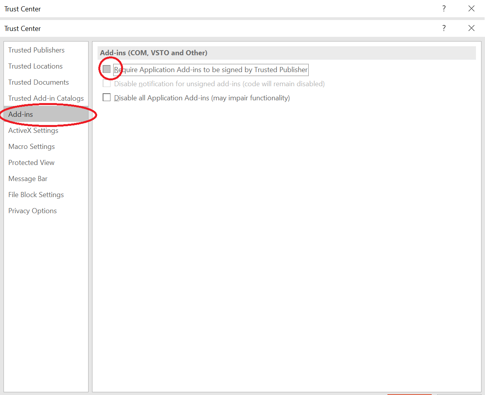

## VSTO Installer Config Error<a name="vsto-installer-config"></a>
#### Error Message
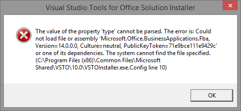
#### Solution
1. Click the Windows Start button and paste `<VSTO Folder Path>` into the search box. Note that `<VSTO Folder Path>` would be stated in the error message, e.g. `C:\Program Files (x86)\Common Files\Microsoft Shared\VSTO\10.0`
1. Enter and it should open up the VSTO folder
1. Find a file named `VSTOInstaller.exe.Config`
1. Rename the file to `VSTOInstaller.exe.Config.old`. Ignore Windows warning about the file becoming unusable
1. Run PowerPointLabs installer again
1. After installation has completed, reopen the VSTO folder and rename the file back to `VSTOInstaller.exe.Config` again

## NET Framework Not Installed<a name="net-not-installed"></a>
#### Error Message
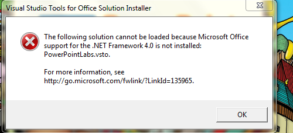
#### Solution
1. Follow these [instructions](https://msdn.microsoft.com/en-sg/library/ms178739.aspx) to install Visual Studio Tools for Office runtime
1. Install PowerPointLabs again

## VSTO Opens as XML Error<a name="vsto-as-xml"></a>
#### Error
Add-in failed to install, and browswer opens up with the following image
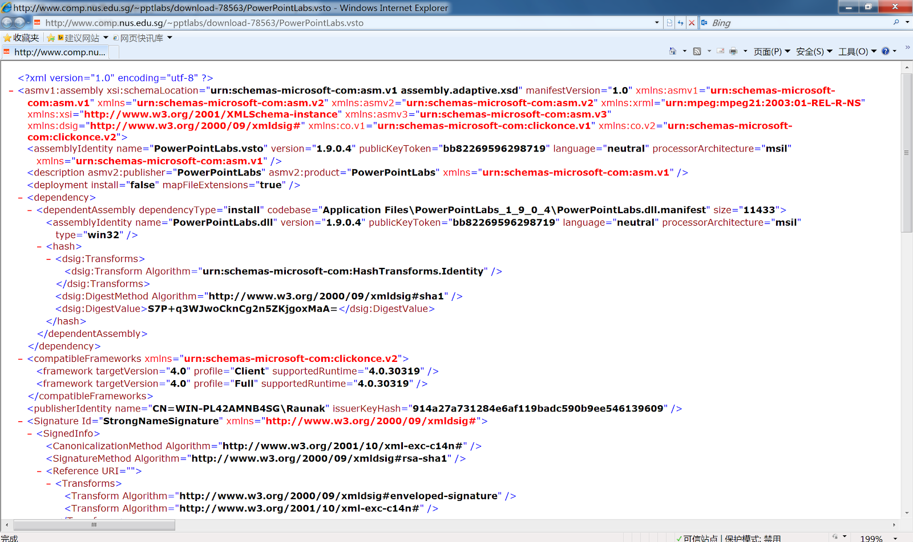
#### Solution
1. Follow these [instructions](https://msdn.microsoft.com/en-sg/library/ms178739.aspx) to install Visual Studio Tools for Office runtime
1. Install PowerPointLabs again

## Missing PowerPointLabs Ribbon<a name="missing-ribbon"></a>
#### Error
After installation, PowerPointLabs ribbon do not show even after launching PowerPoint
#### Solution
1. Restart PowerPoint, else restart Windows and try again
1. Try the following steps to re-activate add-in:
   1. In PowerPoint application, click `File` tab at the top left corner
   1. Click `Options` button
   1. Click `Trust Center` -> `Trust Center Settings` -> `Add-ins`
   1. Uncheck all boxes and click `OK`
   1. Under PowerPoint options, click `Add-ins`
   1. Beside `Manage`, click `Go`
   1. Check `PowerPointLabs` to enable it and click `OK`
   1. Restart PowerPoint

## Corruption requiring renaming of VSTOInstaller.exe.config File<a name="rename-vsto-file"></a>
#### Error Message
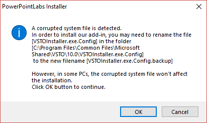
#### Solution
1. Rename the file to any appropriate name
1. Ensure that you have admin permissions and follow these [instructions](https://msdn.microsoft.com/en-sg/library/ms178739.aspx) to re-install Visual Studio Tools for Office runtime
1. Ensure that you right-click on the `vstor_redist.exe` (VSTO Installer) installation file and choose `Run as Administrator` before starting the installation

## Installation Failure caused by ClickOnce Cache<a name="clickonce-cache"></a>
#### Error Message
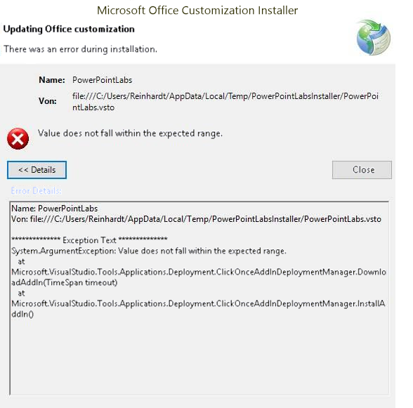
#### Solution
1. Follow these [instructions](https://msdn.microsoft.com/en-sg/library/ms178739.aspx) to install Visual Studio Tools for Office runtime
1. Open `Start`
1. Type `cmd` and press `Enter`
1. Paste the following command and press `Enter`: `rundll32 %windir%\system32\dfshim.dll CleanOnlineAppCache`
1. Reinstall PowerPointLabs again

## Referenced Assembly Not Installed<a name="assembly-not-installed"></a>
#### Error Message
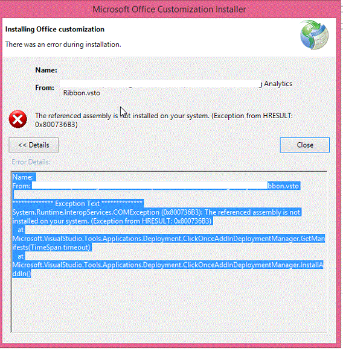
```
System.Runtime.InteropServices.COMException (0x800736B3): The referenced assembly is not installed on your system. (Exception from HRESULT: 0x800736B3)
 at Microsoft.VisualStudio.Tools.Applications.Deployment.ClickOnceAddInDeploymentManager.DownloadAddIn(TimeSpan timeout)
 at Microsoft.VisualStudio.Tools.Applications.Deployment.ClickOnceAddInDeploymentManager.InstallAddIn()
```
#### Solution
1. Open `Start`
1. Type `cmd` and press `Enter`
1. Paste the following command and press `Enter`: `rundll32 %windir%\system32\dfshim.dll CleanOnlineAppCache`
1. Reinstall PowerPointLabs
1. Else, delete folder `%LocalAppData%\Apps\2.0` and reinstall PowerPointLabs again

## Corrupted Zip Installer<a name="corrupted-zip"></a>
#### Error
Unable to unzip the installer and/or error message associated with operation of unzipping the installer
#### Solution
1. Re-download the installer files and try installing again
1. If multiple re-downloads fail, download the setup.exe directly [here](https://www.google.com/url?q=http%3A%2F%2Fwww.comp.nus.edu.sg%2F~pptlabs%2Fdownload-78563%2FPowerPointLabsInstaller.zip) and re-install

## Installation Error due to Preexisting Similar Application<a name="preexisting-application"></a>
#### Error Message

#### Solution
1. Go to `File Explorer`
1. Type in `%LocalAppData%\Apps\2.0` in the navigation bar and press `Enter`
1. Using the search bar on the top-right corner, locate the `Manifests` folder
1. Delete all files starting with `powe...` as shown in the below image
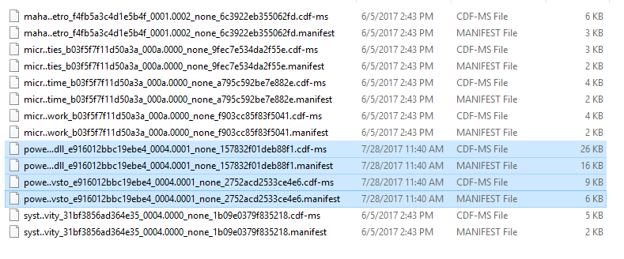

## Error Loading Manifest from MahApps.Metro.dll<a name="error-manifest"></a>
#### Error Message
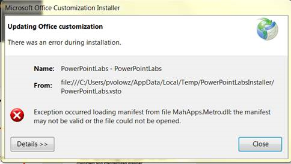
#### Solution
1. Open `Start`
1. Type `cmd` and press `Enter`
1. Type in `cd %LocalAppData%\Temp\Deployment\1HKX7LKW.XZD\HYEJO9YP.GNM`
1. Type in `tasklist.exe /m MahApps.Metro.dll`
1. Determine which process is using the dll and end it if possible
1. Else, temporarily disable any anti-virus software that may be preventing the use of the .dll file and then delete folder `%LocalAppData%\Temp\Deployment`, before reinstalling PowerPointLabs again
